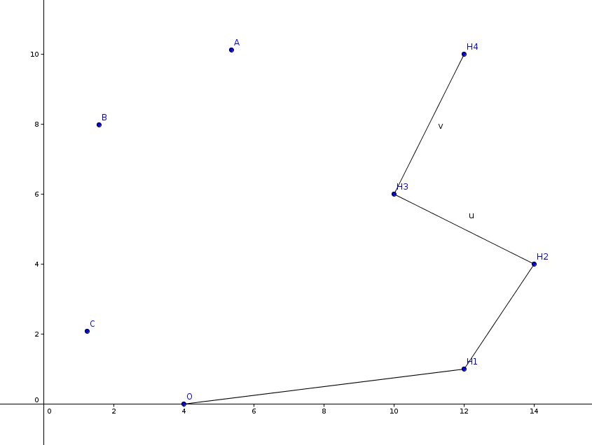

# Tìm bao lồi và các thuật toán tìm kiếm

***[Tìm bao lồi là gì?](BaoDong.md)***
# Thuat toan Graham





```php
type
  Point = record  // Kiểu dữ liệu điểm
    x,y: real;
    ind: integer; // chỉ số trong mảng ban đầu
  end;

var
  n: integer; // số điểm
  a, b: array[1..maxn] of Point; // a: mảng input, b: bao lồi

Procedure Swap(var p1, p2: Point); // Hàm đổi chỗ 2 điểm
Var
  temp: Point;
Begin
  temp:=p1; p1:=p2; p2:=temp;
End;

Function CCW(p1,p2,p3:Point):integer; // Xem từ p1 --> p2 --> p3 là rẽ trái (1), đi thẳng (0) hay rẽ phải (-1)
Var
  t, a1, a2, b1, b2: real;
Begin
  a1 := p2.x - p1.x;
  b1 := p2.y - p1.y;
  a2 := p3.x - p2.x;
  b2 := p3.y - p2.y;
  t  := a1*b2 - a2*b1;
  If abs(t) < esp then CCW:=0
  else if t<0 then CCW:=-1
  else CCW:=1;
End;

Function Lower(p1, p2: Point):boolean; // So sánh để sắp xếp các điểm theo góc
Var
  c: integer;
Begin
  c := CCW(a[1], p1, p2);
  Lower:=false;
  If (c > 0) then Lower:=true
  else If (c = 0) and ((p1.x<p2.x) or ((p1.x=p2.x) and (p1.y<p2.y)))
       then Lower:=true;
End;

Procedure QuickSort; // Sắp xếp các điểm của mảng a theo góc
  Procedure Sort(l, r: integer);
  Var
    i, j: integer;
    x: Point;
  Begin
    i := l; j := r; x := a[(l+r) div 2];
    repeat
      while lower(a[i], x) do inc(i);
      while lower(x, a[j]) do dec(j);
      if i <= j then
        begin
          Swap(a[i], a[j]);
          inc(i); dec(j);
        end;
    until i>j;
    if i<r then Sort(i, r);
    if l<j then Sort(l, j);
  End;
Begin
  If n > 2 then Sort(2, n);
End;

Procedure Graham;
Var
  i, c: integer;
Begin
  // Tìm điểm có tung độ nhỏ nhất
  c := 1;
  For i := 2 to n do
    If (a[i].y < a[c].y) or ((a[i].y = a[c].y) and (a[i].x < a[c].x)) then
      c := i;
  // Đổi chỗ điểm tung độ nhỏ nhất về a[1]
  Swap(a[c], a[1]);

  m := 2; b[1] := a[1]; b[2] := a[2];
  b[1].ind := 1; b[2].ind := 2;
  For i := 3 to n do
    begin
      // Loại bỏ b[m] nếu ta xác định được nó không thuộc bao lồi
      while (m > 1) and (CCW(b[m-1], b[m], a[i]) = -1) do dec(m);

      // Thêm điểm a[i] vào bao lồi
      inc(m);
      b[m] := a[i];
      b[m].ind := i;
    end;
End;
```


- [CCW là gì?](ccw.md)
