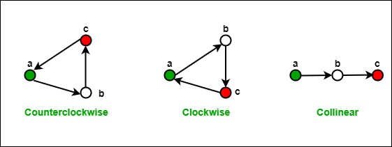
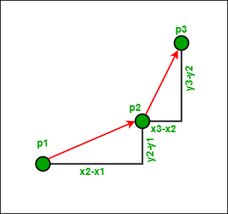

# Định hướng của 3 điểm có thứ tự (counterclock) 
***www.geeksforgeeks.org***
### CTK - MTA
Định hướng của bộ ba điểm có thứ tự trong mặt phẳng có thể là

- ngược chiều kim đồng hồ (counterclockwise)
- theo chiều kim đồng hồ (counterclock)
- thẳng hàng (collinear)




Nếu định hướng của (p1, p2, p3) thẳng hàng, thì định hướng của (p3, p2, p1) cũng thẳng hàng. 

Nếu hướng của (p1, p2, p3) là theo chiều kim đồng hồ thì hướng của (p3, p2, p1) là ngược chiều kim đồng hồ và ngược lại cũng đúng.

## Làm thế nào để tính toán Định hướng? 


Ý tưởng là sử dụng độ dốc.  




- Độ dốc của đoạn thẳng (p1, p2): σ = (y2 - y1) / (x2 - x1) 
- Độ dốc của đoạn thẳng (p2, p3): τ = (y3 - y2) / (x3 - x2) 

Nếu σ> τ , hướng theo chiều kim đồng hồ (rẽ phải) 

Sử dụng các giá trị trên của σ và τ, chúng ta có thể kết luận rằng, 
hướng phụ thuộc vào dấu của biểu thức dưới đây: 

(y2 - y1) * (x3 - x2) - (y3 - y2) * ( x2 - x1) 

Biểu thức trên là âm khi σ <τ, tức là ngược chiều kim đồng hồ


```php
#include <iostream>
using namespace std;
 
struct Point
{
    int x, y;
};

int orientation(Point p1, Point p2, Point p3)
{
    int val = (p2.y - p1.y) * (p3.x - p2.x) -
              (p2.x - p1.x) * (p3.y - p2.y);
 
    if (val == 0) return 0;  // collinear
 
    return (val > 0)? 1: 2; // clock or counterclock wise
}

int main()
{
    Point p1 = {0, 0}, p2 = {4, 4}, p3 = {1, 2};
    int o = orientation(p1, p2, p3);
    if (o==0)         cout << "Linear";
    else if (o == 1)  cout << "Clockwise";
    else              cout << "CounterClockwise";
    return 0;
}

```


Source : [https://www.geeksforgeeks.org/orientation-3-ordered-points/](https://www.geeksforgeeks.org/orientation-3-ordered-points/)
